# Gemini Live Mobile Clone 🌌

<p align="center">
  
</p>

<!-- Live Animated CSS Orb Visualizer (Renders beautifully on GitHub) -->
<div align="center">
  <div style="background: radial-gradient(circle, #0f172a 0%, #020617 100%); padding: 40px; border-radius: 24px; max-width: 500px; box-shadow: 0 20px 50px rgba(0,0,0,0.6); border: 1px solid rgba(255,255,255,0.05); position: relative; overflow: hidden; margin: 25px auto;">
    
    <!-- Animated Glowing Background -->
    <div style="position: absolute; top: -50%; left: -50%; width: 200%; height: 200%; background: radial-gradient(circle, rgba(26,115,232,0.12) 0%, rgba(138,180,248,0) 60%); animation: pulseBg 10s infinite alternate ease-in-out; pointer-events: none;"></div>

    <!-- Live Animated Orb Wrapper -->
    <div style="position: relative; width: 180px; height: 180px; margin: 0 auto; display: flex; align-items: center; justify-content: center;">
      <!-- Glowing outer circle -->
      <div style="position: absolute; width: 150px; height: 150px; border-radius: 50%; background: radial-gradient(circle, rgba(26,115,232,0.45) 0%, rgba(26,115,232,0) 70%); filter: blur(12px); animation: orbGlow 4s infinite alternate ease-in-out;"></div>
      <!-- Swirling Particle Rings -->
      <div style="position: absolute; width: 160px; height: 160px; border: 1.5px dashed rgba(26,115,232,0.35); border-radius: 50%; animation: spinRight 15s infinite linear;"></div>
      <div style="position: absolute; width: 130px; height: 130px; border: 1.5px dashed rgba(138,180,248,0.25); border-radius: 50%; animation: spinLeft 10s infinite linear;"></div>
      <!-- Central pulsating stardust nebula -->
      <div style="position: absolute; width: 100px; height: 100px; border-radius: 50%; background: radial-gradient(circle, #8ab4f8 0%, #1a73e8 40%, rgba(26,115,232,0) 80%); animation: nebulaPulse 3.5s infinite alternate ease-in-out; filter: drop-shadow(0 0 18px #1a73e8);"></div>
    </div>

    <!-- Active Status Badge -->
    <div style="margin-top: 30px; display: inline-flex; align-items: center; background: rgba(26,115,232,0.15); border: 1px solid rgba(26,115,232,0.3); padding: 8px 20px; border-radius: 50px; animation: statusGlow 2.5s infinite alternate;">
      <span style="width: 8px; height: 8px; background: #8ab4f8; border-radius: 50%; display: inline-block; margin-right: 10px; box-shadow: 0 0 10px #8ab4f8;"></span>
      <span style="color: #8ab4f8; font-family: system-ui, -apple-system, sans-serif; font-size: 13px; font-weight: bold; letter-spacing: 1.5px;">GEMINI LIVE ACTIVE</span>
    </div>

    <!-- Custom CSS Keyframes for Interactive Animation -->
    <style>
      @keyframes pulseBg {
        0% { transform: scale(1) translate(0, 0); }
        100% { transform: scale(1.1) translate(4%, 4%); }
      }
      @keyframes orbGlow {
        0% { transform: scale(0.9); opacity: 0.5; }
        100% { transform: scale(1.15); opacity: 0.95; }
      }
      @keyframes nebulaPulse {
        0% { transform: scale(0.8) rotate(0deg); filter: hue-rotate(0deg) drop-shadow(0 0 12px #1a73e8); }
        100% { transform: scale(1.08) rotate(180deg); filter: hue-rotate(45deg) drop-shadow(0 0 28px #8ab4f8); }
      }
      @keyframes spinRight {
        from { transform: rotate(0deg); }
        to { transform: rotate(360deg); }
      }
      @keyframes spinLeft {
        from { transform: rotate(360deg); }
        to { transform: rotate(0deg); }
      }
      @keyframes statusGlow {
        0% { box-shadow: 0 0 6px rgba(26,115,232,0.2); }
        100% { box-shadow: 0 0 18px rgba(26,115,232,0.55); }
      }
    </style>
  </div>
</div>

<p align="center">
  
  
  
  
  
</p>

---

## ✨ Overview

Welcome to the **Gemini Live Mobile Clone**, a premium, production-grade Android implementation of a natural voice dialogue terminal powered by Jetpack Compose and the Google Gemini API. 

The application replicates the voice capabilities of modern AI interfaces, integrating highly fluid 3D physical stardust animations, system overlay permissions routing, screen scanning, and local screenshot testing.

---

## 🎨 Premium Visual Highlights

### 🤖 Specialized AI Chatbot Roles
The app features dynamically swappable, model-aligned chatbot personas complete with system instructions and custom badge indicator styling:

| Role Persona | Icon | Model Used | Best For |
| :--- | :---: | :---: | :--- |
| **General Assistant** | Sparkle ✨ | `gemini-3.5-flash` | Daily tasks, conversational inquiries, general answers. |
| **Coding Expert** | Bracket `</>` | `gemini-3.1-pro` | Writing, refactoring, and debugging production-grade code. |
| **Math & Logic Coach** | Math `f(x)` | `gemini-3.1-pro` | Comprehensive logic, analytical calculations, and math proofs. |
| **Speed Assistant** | Lightning ⚡ | `gemini-3.1-flash-lite` | Ultra-fast responses, light text checks, instant prompts. |

### 🌟 High-Fidelity 3D Golden-Ratio Stardust Orb (`GeminiLiveOrb.kt`)
*   **600 Particle Coordinates**: Simulated dynamically on an analytical spherical coordinate field using the Golden Ratio angle distribution ($137.5^\circ$).
*   **Differential Y-Swirling (Galactic Shear)**: Swirls independent horizontal belts of stardust at varying speeds to prevent artificial rigidity and produce organic fluid motion.
*   **True 3D Depth Sorting & Occlusion**: Dynamically computes depth values ($Z$-axis mapping). Particles in the foreground are rendered larger and brighter, while back-most particles recede gracefully in slate-grey tones to produce an advanced sense of depth.
*   **Drag & Touch Physics**: The entire particle-based interactive orb can be touched, dragged, and positioned anywhere on the screen seamlessly, automatically dismissing duplicate background triggers.
*   **Real-time Vocal Resonance**: Animates, vibrates, and breathes outward based on direct micro-amplitude feedback from active vocal/speech frequencies.

### 📱 Perfect System Navigation & Edge-to-Edge Padding
*   **Virtual Key Clearance**: Solves bottom control layout clipping issues under virtual system navigation keys (Home, Back, Recents) using Jetpack's native `.navigationBarsPadding()` configurations.
*   **High Contrast Canvas**: Features a warm neutral off-white surface wrapped in an eye-safe gradient blending into subtle sky-blue accents.

---

## 🛠️ Key Technical Implementations

1.  **System-Alert Overlays (`GeminiOverlayService`)**: Houses a background service allowing the live floating conversational orb to persist and animate above external apps and the home launcher.
2.  **Interactive Contextual Screen Projection**: Sweeps the launcher view and matches local contexts (Maps, YouTube, etc.) to query Gemini on active screen states.
3.  **Advanced Sign-In & Configuration Resilience**: Refactored Gradle configurations (`signingConfigs`) to check for the presence of local release keys dynamically. If not found, it seamlessly signs with the default `debug.keystore` fallback instead of crashing the compiler.

---

## 🧬 Local Verification & Testing

The project is fully integrated with **Robolectric** and **Roborazzi** for fast, local JVM simulation and visual snapshot regression analysis.

### Run Unit & Robolectric Tests
```bash
./gradlew testDebugUnitTest
```

### Record Reference Screenshots (Roborazzi)
```bash
./gradlew recordRoborazziDebug
```

### Verify Screenshot Changes
```bash
./gradlew verifyRoborazziDebug
```

---

## 🤖 GitHub Actions CI/CD Pipeline (`android.yml`)

The repository includes a modern, high-speed automated integration workflow:
1.  **Repository Checkout**: Restores the code.
2.  **JDK 17 Setup**: Configures the Zulu JDK 17 with active Gradle caching.
3.  **Environment Config Recovery**: Safely configures local `.env` keys from `.env.example`.
4.  **Keystore Decoding**: Restores and decodes your original `debug.keystore.base64` binary to bypass local gitignore rules.
5.  **Automated Quality Checks**: Executes the unit and screenshot testing suite.
6.  **Apk Packaging**: Builds the final, signed release and debug APKs and packages them as a downloadable run artifact (**`gemini-live-debug-apk`**).

---

## 🔧 Troubleshooting & Deep Technical Fixed

<details>
<summary><b>1. KSP / Kotlin Symbol Processor NullPointerExceptions</b></summary>

*   **The Error**: `Exception in thread "AWT-EventQueue-0" java.lang.NullPointerException: Cannot invoke Application.getService()` during the compilation of room models.
*   **The Resolution**: We identified that forcing the compiler to run inside the main Gradle process via `kotlin.compiler.execution.strategy=in-process` (in `gradle.properties`) prevents KSP from isolating the IntelliJ classloader. Commenting out this strategy allows Kotlin and KSP to launch separate background daemons, restoring complete compile-time stability.
</details>

<details>
<summary><b>2. Draw-Over-Apps System Lockup</b></summary>

*   **The Error**: The conversational screen appears to lock up or freeze when triggering screen-share features.
*   **The Resolution**: Because Android security policies require explicit system alert configurations, the app redirects the user to the system "Display over other apps" page. Ensure you scroll to the application in the list, enable the switch to **"Allowed"**, and click back to initiate the floating live overlay orb instantly!
</details>
